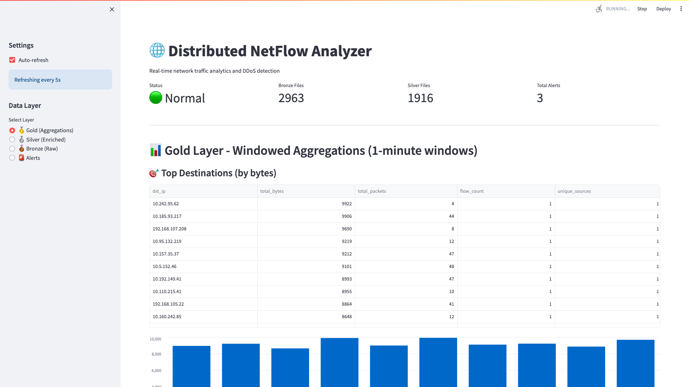

# 🌐 Network Traffic Analyzer

**A simple tool to monitor your network traffic and stop hackers in real time.**

## 🤔 What does this do?
Think of this project as a **smart security camera for your internet connection**. It tracks all the data coming in and out of your system to make sure everything is safe and normal. 

If it spots something suspicious—like a hacker trying to overload your network to take it down (a DDoS attack)—it immediately catches the problem and alerts you. 

### ✨ Key Features
- 👀 **Live Monitoring:** Get a real-time, easy-to-understand visual representation of your internet traffic.
- 🚨 **Automatic Threat Detection:** It constantly watches for unusual patterns that point to a cyberattack.
- ⚡ **Super Fast & Scaleable:** It's built to handle incredible amounts of data without skipping a beat, no matter how large your network is.

## 📸 Dashboard Preview
Here is what you see when the project is running:



## 🚀 How to run it
It's very easy to start the project. Just follow these steps:

**1. Download the code:**
```bash
git clone https://github.com/yourusername/netflow-ddos-spark.git
cd netflow-ddos-spark
```

**2. Start the system:**
```bash
docker-compose up -d
```

**3. Open the dashboard:**
Go to `http://localhost:8501` in your web browser to view your live network traffic!

---

*For developers: Under the hood, this project uses Go, Apache Spark, and Kafka to process massive volumes of network data with zero downtime.*
